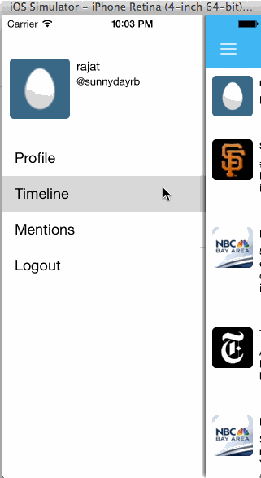

Churper - A twitter Client
=========================

Time spent:  15 hours spent in total

Hamburger menu

- [x] Dragging anywhere in the view should reveal the menu.
- [x] The menu should include links to your profile, the home timeline, and the mentions view.
- [x] The menu can look similar to the LinkedIn menu below or feel free to take liberty with the UI.

Profile page

- [x] Contains the user header view
- [ ] Optional: Implement the paging view for the user description.
- [ ] Optional: As the paging view moves, increase the opacity of the background screen. See the actual Twitter app for this effect
- [x] Optional: Pulling down the profile page should blur and resize the header image. (Blur didn't work)
- [x] Contains a section with the users basic stats: # tweets, # following, # followers

Home Timeline

- [x] Tapping on a user image should bring up that user's profile page

Account switching (optional)
- [ ] Long press on tab bar to bring up Account view with animation
- [ ] Tap account to switch to
- [ ] Include a plus button to Add an Account
- [ ] Swipe to delete an account

Cocoa Pods Used: 

AFNetworking
BDBOAuth1Manager
Mantle
SVProgressHUD
MHPrettyDate  - Awesome for dates!! 

Description of the project:

Project Twitter APIs to login using Oauth. After login it calls the APIs to get the data and do basic twitter functionality of creating a tweet, retweet, reply and favorite. 

